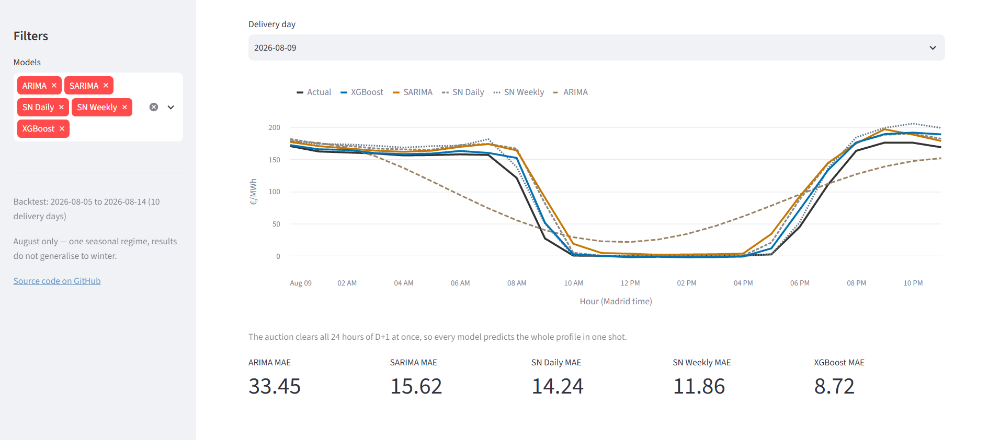

# Spanish day-ahead electricity price forecasting
 
Forecasting the 24 hourly clearing prices of the Spanish day-ahead electricity market (OMIE, published through ENTSO-E). The auction closes at 12:00 CET on day D and clears all 24 hours of day D+1 in a single shot, so the whole next-day profile has to be predicted at once, from information available today.
 
**[Live demo →](https://spain-electricity-price-forecasting.streamlit.app/)**
 

 
## Results
 
| Model                    | MAE (€/MWh) | MASE |
|--------------------------|-------------|------|
| ARIMA (non-seasonal)     | 37.21       | 1.89 |
| Seasonal naive (weekly)  | 18.76       | 0.95 |
| Seasonal naive (daily)   | 15.50       | 0.79 |
| SARIMA (24h seasonality) | 14.46       | 0.74 |
| **XGBoost**              | **12.58**   | **0.64** |
 
**MAE** is the average error in euros per MWh. **MASE** puts that on a scale where 1.0 means
"no better than copying yesterday's prices". `MASE = MAE of model / MAE of seasonal naive`
 
The naive baselines are in the table on purpose: in this market, copying yesterday is already
a strong forecast, because the daily price shape is stable. A model that cannot beat it is not
adding anything.
 
## Why the price behaves the way it does
 
Electricity cannot be stored at scale, so it has to be generated at almost the exact moment it
is consumed. That constraint is why the price is set by a daily auction rather than by inventory.
 
Generators bid the minimum price they will accept for each hour, roughly the cost of producing
one more MWh: near zero for wind and solar, high for gas, which has to pay for fuel and CO₂ allowances. OMIE sorts every bid from cheapest to most expensive, the **merit order**, and accepts them in that order until demand is covered. The price of the *last* bid needed becomes the price paid to **every** accepted generator, cheap ones included, called **marginal price**.
 
That single rule explains most of what makes this series hard:
 
- A windy day is cheap not because wind is cheap, but because high renewable output pushes gas out of the merit order entirely.
- **Prices go negative.** When renewables generation exceeds demand, the marginal bid comes from a producer willing to pay to stay online rather than shut down and restart. The floor across coupled European markets is currently −600 €/MWh, and Spain gets there often: 4.4% of hours since October 2022, 12.8% of 2026 so far, over 30% in May 2025.
- **The series is spiky and asymmetric.** The supply curve is nearly flat where renewables and nuclear sit, then turns steeply upward. A small change in demand or wind moves the price a long way, or not at all. Because prices cross zero regularly, percentage-based error metrics are undefined or misleading. Errors here are reported in euros per MWh.
 
## How the models were tested
 
- **10 delivery days**, 5–14 August 2026, each scored as a complete day. The day is the unit of evaluation because that is what the auction produces.
- **Training always stops before the day being predicted.**
- **Nothing is tuned on the test days.** Test data is used once, to report.
  
Two caveats worth mentioning:
 
XGBoost is refit on the full four-year history for each day. SARIMA only uses the last 60 days, and its structure is estimated once and reused, because refitting it repeatedly on four years of hourly data is too slow to be practical. The table compares how each model would realistically be deployed, not the two model families given identical data.
 
All 10 test days are consecutive days in August: high solar, high cooling demand. The numbers should not be assumed to hold in winter.
 
## Where the model underperforms 

XGBoost does not convincingly beat SARIMA yet. It reports a lower MAE, but the two are not trained on the same amount of history (60 days versus the full four years), the backtest is only 10 delivery days, and the confidence interval around a difference that size is wider than the difference itself. 

The working hypothesis is that without exogenous inputs, wind, solar and demand forecasts, which are the physical drivers of Spanish prices, a tree model on calendar features and own-price lags can only approximate a smoothed seasonal naive. Feature importance is consistent with this: `lag_24h` alone carries roughly half the gain. Adding ENTSO-E generation and load forecasts is the next step, and it is the change most likely to produce a real improvement rather than a nicer-looking number.
 
## Guarding against data leakage
 
Leakage, letting the model see information it would not have had in reality, is the main way
forecasting results become fiction. How it is handled:
 
- **Every price-based feature is shifted by at least 24 hours** (`lag_24h`, `lag_48h`, `lag_168h`, and a 7-day rolling mean). Hour 23 of tomorrow clears at the same instant as hour 00, so anything shorter would use a price that does not exist yet at auction time.
- **Splits are always chronological.** Each test day is predicted by a model trained only on earlier data.
- **The hourly timeline is made explicit before any shift is applied**, so a missing timestamp cannot silently push every lag out of alignment.

  
## Limitations
 
- Prices are stored in Madrid local time. The October changeover creates a duplicated 02:00 (dropped) and the March one creates a gap (left as missing). Lag alignment still holds, but those days genuinely have 23 or 25 hours and are not flagged.
- **10 test days is a small sample**, limited by how long the SARIMA fits take.
- **No weather or demand inputs yet.** See the section above.
- **The dataset is frozen at 2026-08-14** so results stay reproducible. The dashboard reads that
  snapshot; there is no live data feed yet.

  
## Repo map
 
```
notebooks/01_spain_hourly_dataset.ipynb   ENTSO-E download, parsing, cleaning
notebooks/02_EDA.ipynb                    exploratory analysis
notebooks/03_baseline_models.ipynb        naive / seasonal naive / ARIMA / SARIMA
notebooks/04_xgboost.ipynb                features, cross-validation, final model
src/paths.py                              project paths
src/features.py                           feature engineering (mirrors notebook 04)
src/predict.py                            next-day inference
app/app.py                                Streamlit dashboard
data/raw/                                 raw ENTSO-E files (not committed)
data/processed/                           hourly prices, CV predictions, CV metrics
models/                                   the trained XGBoost model
```
 
The notebooks deliberately repeat the feature code instead of importing `src/`, so each one reads top to bottom without jumping between files. `src/features.py` carries a note reminding that a change to a feature has to be made in both places.
 
## Setup
 
```bash
python -m venv .venv
.venv\Scripts\activate           # Windows;  source .venv/bin/activate on Linux/macOS
pip install -r requirements.txt
pip install -e .
 
copy .env.example .env           # then paste your ENTSO-E token into it
streamlit run app/app.py
```
 
Only notebook 01 needs the API token; everything else reads from `data/processed/`.
 
## Data source
 
[ENTSO-E Transparency Platform](https://transparency.entsoe.eu/), day-ahead prices for the Spanish bidding zone, from 2022-10-01 onwards.
 
Spain switched from hourly to 15-minute market intervals in October 2025, so the raw data comes
in two formats. Notebook 01 averages the four quarters of each hour, which reproduces the official hourly price, so the target stays consistent across the whole period.
 
